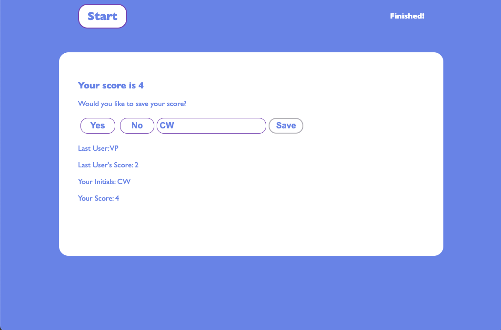

# Timed Coding Quiz

## Project Scope

This timed coding quiz tests a user's knowledge of fundamental Javascript concepts. The quiz is multiple-choice and timed. The quiz begins when the Start button is clicked. The quiz gives the option to save the user's score at the end. 

---

## Functionality 

The following criteria include required quiz functionalities:

- A timer starts when a user clicks the "Start" button
- The user is presented with a series of multiple-choice questions 
- As soon as the user answers a question, the next question is presented 
- When the user answers a question incorrectly, time is subtracted from the timer 
- The quiz ends when the user answers all questions or when time runs out
- The user is then able to enter his/hers initials and save the score 
- The user can view the initials and score of a user who previously saved their score

(<a href="#timed-coding-quiz">back to top</a>)

---

## Demo 

This mock-up demonstrates the welcome message before a user starts the timer. 

(<a href="#timed-coding-quiz">back to top</a>)

This mock-up demonstrates the functionality of the timer and the multiple-choice buttons the user is presented with.

(<a href="#timed-coding-quiz">back to top</a>)

This mock-up demonstrates the message user gets when he/she saves his/hers score. 

(<a href="#timed-coding-quiz">back to top</a>)

---

## Application link

[Check out the Javascript Quiz here!]()

(<a href="#timed-coding-quiz">back to top</a>)

---

## License

Distributed under the MIT License. See `LICENSE.txt` for more information.

(<a href="#timed-coding-quiz">back to top</a>)

---

## Acknowledgments 

This list includes resources used for the project. 

- [Best README Template](https://github.com/othneildrew/Best-README-Template/blob/master/README.md)
- [Flexipile artilce by Varun Omprakash: appendChild](https://flexiple.com/javascript/javascript-appendchild/)
- [Interviewbit Samples of Javascript Questions](https://www.interviewbit.com/javascript-mcq/)
- [StackOverflow answer by plalx: how to access input value](https://stackoverflow.com/questions/21491119/sending-form-text-input-to-console-log-for-testing)
- [StackOverflow answer by Brock Adams: how to add setInterval inside an eventListener](https://stackoverflow.com/questions/17614067/addeventlistener-and-setinterval-fail-silently-in-a-greasemonkey-script)
- [StackOverflow answer by Hessin sai: resize elements to fit inside a div](https://stackoverflow.com/questions/66756449/how-can-you-resize-input-button-elements-to-fit-inside-a-div)
- [StackOverflow answer by Andy E: string manipulation](https://stackoverflow.com/questions/3568921/how-to-remove-part-of-a-string)

(<a href="#timed-coding-quiz">back to top</a>)
